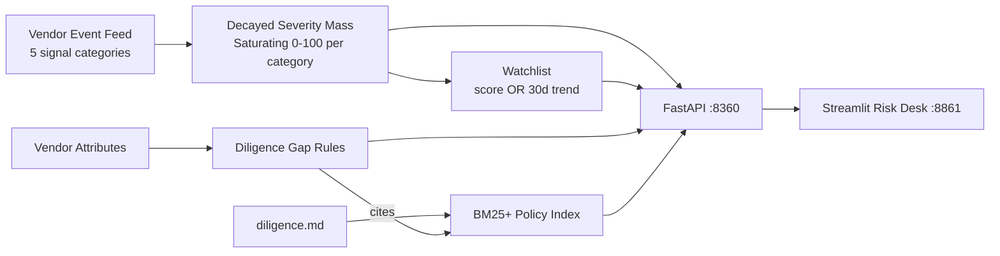

# RiskRadar — Vendor Risk Intelligence & Due-Diligence Platform

<div align="center">

[](https://www.python.org/)
[](https://fastapi.tiangolo.com/)
[](https://streamlit.io/)
[](https://mlflow.org/)
[](https://www.docker.com/)
[](https://github.com/astral-sh/ruff)
[](https://pytest.org/)
[](https://opensource.org/licenses/MIT)

</div>

> **Third-party risk management: time-decayed multi-category risk scoring over an event feed, a deterioration watchlist with measured recall/precision, rule-based diligence gaps grounded in written policy, and a BM25-cited due-diligence assistant.**

---

## 📖 Executive Summary & Value Proposition

**`riskradar`** is a production-grade, end-to-end machine learning system built with strict engineering discipline, reproducible pipelines, and enterprise MLOps best practices. It bridges the gap between theoretical statistical rigor and high-availability operational microservices.

## 🛰️ Core Methodologies & Risk Engineering

### 1. Time-Decayed Multi-Category Scoring
- Five signal categories (security 30%, financial 25%, delivery 20%, compliance 15%, concentration 10%); event severity mass decays with a 90-day half-life and maps through a saturating curve to 0-100 per category.
- Rank recovery vs planted latent riskiness: **Spearman 0.66** — honest, because Poisson event counts + decay make any current score a noisy snapshot (that's the real-world condition of vendor scoring, stated rather than hidden).

### 2. Deterioration Watchlist
- Flags on absolute score OR 30-day trend. Against the planted deteriorating cohort: **recall 6/6 (100%) at 67% precision** (a 9-vendor watchlist out of 60 — not alarm spam).

### 3. Policy-Grounded Diligence Gaps
- Rules compare vendor attributes and event history to the written policy: PII-without-SOC2, single-source concentration over $400k, repeated security incidents, young-vendor financial review — every finding **cites the policy section** it comes from.

### 4. Cited Due-Diligence Assistant
- 12-section diligence policy indexed with BM25+ (vocabulary-filtered so out-of-domain questions honestly return no match); answers arrive as ranked policy sections with scores.

## 📊 Architecture & Pipeline



## 🛠️ Tech Stack & Engineering Standards
- **Core Engine:** Python 3.12, NumPy, SciPy, Pandas, rank-bm25
- **Serving & UI:** FastAPI, Streamlit + Plotly score history, MLflow
- **Testing:** Pytest verification of decay math, rank-recovery bands, watchlist recall, gap-rule firing, RAG citation + junk rejection, and API contracts


---

## 🚀 Quickstart & Setup Guide

### 1. Prerequisites & Environment Setup
Using **[uv](https://docs.astral.sh/uv/)** for lightning-fast, reproducible dependency resolution:

```bash
# Clone the repository
git clone https://github.com/jackson-marcus/riskradar.git
cd riskradar

# Install dependencies and pre-commit hooks
uv sync --group dev
```

### 2. Generate Vendors & Evaluate
```bash
# Synthesize 60 vendors + a year of risk events (deteriorating cohort planted)
uv run python scripts/make_vendors.py

# Score, build the watchlist, evaluate against truth; logs to MLflow
uv run python -m riskradar.models.evaluate
```

### 3. Run Test Suite & Code Quality Checks
```bash
# Run unit & integration tests with coverage
uv run pytest --cov

# Run ruff linter and formatting checks
uv run ruff check .
uv run ruff format --check .
```

### 4. Launch Services Locally
```bash
# Start FastAPI REST API (listening on port :8360)
make api
# Or: uv run uvicorn riskradar.api.main:app --reload --port 8360

# Start interactive Streamlit dashboard (listening on port :8861)
make ui

# Launch local MLflow Experiment Tracking UI (listening on port :5037)
make mlflow
```

### 5. Run with Docker Compose
```bash
# Spin up the complete microservice stack
docker compose up --build
```

---

## 📂 Repository Layout

```
riskradar/
├── .github/workflows/ci.yml       # GitHub Actions CI pipeline (lint, test, build)
├── configs/                      # Scoring weights, decay, and RAG configuration
├── data/                         # Generated vendors/events + scored artifacts
├── docs/diligence.md             # 12-section due-diligence policy (RAG corpus)
├── scripts/                      # make_vendors.py event-history generator
├── src/riskradar/                # Core Python package
│   ├── api/                      # FastAPI routes: /vendors /vendor /watchlist /diligence/ask
│   ├── models/                   # Evaluation against planted truth + MLflow
│   ├── rag/                      # BM25+ policy assistant
│   ├── risk/                     # Decayed scoring, trends, gap rules
│   ├── ui/                       # Streamlit risk desk application
│   └── settings.py               # Centralized configuration & environment loader
├── tests/                        # Comprehensive Pytest suite
├── docker-compose.yml            # Multi-service container orchestration
├── Dockerfile                    # Container definition for API service
├── Makefile                      # Standardized project tasks
└── pyproject.toml                # Pinned dependencies and tool configs
```

---

## 👤 Author & Contact

**Jackson Marcus**
- **Email:** [jackson.marcus.work@gmail.com](mailto:jackson.marcus.work@gmail.com)
- **Upwork:** [Jackson Marcus on Upwork](https://www.upwork.com/freelancers/~012235717501ad9c7b)
- **GitHub:** [@jackson-marcus](https://github.com/jackson-marcus)

*Available for machine learning engineering, MLOps, data science, and AI system architecture consulting and contract engagements.*
