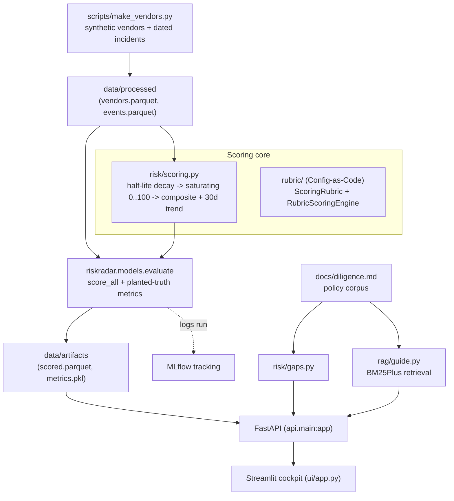

<div align="center">


</div>

# RiskRadar — Third-Party Vendor Risk Scoring Engine

**Continuous third-party vendor risk assessment driven by a Config-as-Code scoring rubric.** RiskRadar treats each vendor's incident history as a decaying signal: recent problems weigh more than old ones, scores saturate on a 0–100 scale, and a 30-day trend flags vendors that are *getting worse* before they breach. The scoring policy — category weights, decay half-lives, escalation thresholds — lives in a declarative, self-validating rubric rather than being hard-coded, so a risk officer can version it like any other artifact.

<div align="center">

[](https://www.python.org/)
[](https://fastapi.tiangolo.com/)
[](https://pytest.org/)
[](https://opensource.org/licenses/MIT)

</div>

> **Portfolio project.** Built to demonstrate the Config-as-Code rubric pattern and time-decay risk modelling on realistic (synthetic) vendor data. Not hardened for production use.

---

## The problem

Third-party risk teams juggle hundreds of vendors, and the usual tools — spreadsheets and point-in-time questionnaires — go stale the moment they're filled in. A vendor that passed review a year ago may be quietly accumulating security findings, missed SLAs, and late filings right now. Two things are hard: keeping a score that *reflects how recent* the trouble is, and adapting the scoring policy across frameworks (SOC 2, ISO 27001, HIPAA, GDPR) without a code change every time.

RiskRadar addresses both. It turns each vendor's stream of dated incidents into a continuously-decaying risk score, watches the 30-day trend to catch deteriorating vendors early, and keeps every rule that governs the score in a versioned, declarative rubric.

## What it does

- **Time-decayed risk scoring** — per-category scores across security, financial, delivery, compliance, and concentration, each an exponential half-life decay of incident severity mapped to 0–100.
- **Deterioration watchlist** — compares each vendor's score now vs. 30 days ago; escalates on either an absolute-score or trend-velocity threshold.
- **Policy-grounded diligence gaps** — a rule-based analyzer that flags missing controls (no SOC 2 while handling PII, single-source concentration over budget, etc.), each finding citing a rule from the written policy corpus.
- **Cited due-diligence assistant** — a BM25 lexical search over the policy corpus that answers "what does our policy require here?" with the matching rule text, and declines when nothing matches.

## How it works



The bundled pipeline scores a synthetic vendor catalog through the config-driven scorer in `risk/scoring.py`. The `rubric/` package is the same math expressed as a reusable, declarative engine — the Config-as-Code pattern described below.

## Config-as-Code scoring rubric

Rather than burying weights and decay factors in stored procedures or controllers, RiskRadar models the scoring policy as data. A `ScoringRubric` is a frozen, self-validating dataclass: it rejects on construction if the category weights don't sum to 1.0, and each `CategorySpec` validates its own decay and saturation parameters. Because a rubric carries a `version`, every score traces deterministically back to the policy that produced it.

The shipped default rubric (`RubricScoringEngine.create_default_rubric`):

| Category | Weight | Half-life | Saturation (κ) | Target signals |
|---|---|---|---|---|
| Security | 0.35 | 90 d | 5.0 | CVEs, credential leaks, phishing incidents |
| Financial | 0.25 | 90 d | 5.0 | Credit downgrades, late filings, layoffs |
| Compliance | 0.15 | 90 d | 5.0 | Audit findings, expired certs, policy violations |
| Delivery | 0.15 | 90 d | 5.0 | SLA breaches, missed windows, quality escapes |
| Concentration | 0.10 | 90 d | 5.0 | Single-source dependence, capacity constraints |

Each category supports three decay schedules — `EXPONENTIAL_HALF_LIFE`, `LINEAR`, and `STEP` — so a rubric can model "severity halves every 90 days" or "findings expire after a fixed window" per category.

### The math

**1. Time decay.** An incident of severity $s_k$ that occurred $\Delta t_k$ days ago is discounted by an exponential half-life kernel:

$$\lambda(\Delta t) = \left(\tfrac{1}{2}\right)^{\Delta t / t_{1/2}}$$

**2. Saturating category score.** The decayed severity mass for a category, $M_c = \sum_k s_k\,\lambda(\Delta t_k)$, maps to a bounded 0–100 score through a concave saturation, so one catastrophic incident and a swarm of minor ones don't both peg the score identically:

$$S_c = 100\left(1 - e^{-M_c / \kappa}\right)$$

**3. Composite and 30-day velocity.** Categories combine by their validated weights ($\sum_c w_c = 1$), and the trend is the change over the last 30 days:

$$\text{Composite}(t) = \sum_c w_c\,S_c(t), \qquad \text{Velocity}_{30} = \text{Composite}(t) - \text{Composite}(t-30)$$

**4. Watchlist policy.** A vendor is escalated when either the absolute score or the velocity crosses its rubric threshold:

$$\text{Composite}(t) \ge \tau_{\text{score}} \quad\lor\quad \text{Velocity}_{30} \ge \tau_{\text{trend}}$$

## Getting started

```bash
make install                 # uv sync --group dev

uv run python scripts/make_vendors.py        # generate synthetic vendors + events
uv run python -m riskradar.models.evaluate   # score everything, write artifacts, log to MLflow

make api                     # FastAPI on http://localhost:8360
make ui                      # Streamlit cockpit on http://localhost:8861
```

The API and UI read the artifacts produced by the evaluate step; run those two commands first or the API returns `503` until `data/artifacts/scored.parquet` exists.

Optional:

```bash
make mlflow                  # MLflow UI on http://localhost:5037
make docker-up               # docker compose up --build -d
make docker-down
```

### Use the rubric engine directly

```python
from riskradar.rubric import CategorySpec, RubricScoringEngine, ScoringRubric

rubric = ScoringRubric(
    rubric_id="CLOUD-VENDOR-2026",
    version="2.1.0",
    categories=(
        CategorySpec(name="security", weight=0.50, decay_half_life_days=60.0, saturation_kappa=4.0),
        CategorySpec(name="compliance", weight=0.30, decay_half_life_days=90.0, saturation_kappa=5.0),
        CategorySpec(name="delivery", weight=0.20, decay_half_life_days=45.0, saturation_kappa=3.0),
    ),
    watch_score_threshold=55.0,
    watch_trend_threshold=12.0,
)  # raises unless weights sum to 1.0

events = [
    {"day": 120, "category": "security", "severity": 4.0},
    {"day": 165, "category": "security", "severity": 3.0},
    {"day": 170, "category": "delivery", "severity": 2.0},
]

result = RubricScoringEngine.evaluate_vendor(
    rubric=rubric, vendor_id="VEND-ACME", events=events, as_of_day=180
)
print(result.composite_score, result.trend_30d, result.watchlist_flag)
print(result.category_scores)
```

## API

The FastAPI app is `riskradar.api.main:app` (served on port 8360 by `make api`).

| Method | Route | Purpose |
|---|---|---|
| `GET` | `/health` | Liveness check |
| `GET` | `/vendors` | All scored vendors + pipeline metrics, ranked by score |
| `GET` | `/vendor/{vendor_id}` | Detail: score history, recent events, and policy-cited diligence gaps |
| `GET` | `/watchlist` | Vendors escalated by score or 30-day trend |
| `POST` | `/diligence/ask` | BM25 policy lookup; body `{"question": "..."}` |

## Evaluation

Evaluation runs on synthetic vendors whose latent riskiness is planted at generation time, plus a small cohort deliberately made to deteriorate in the final 60 days — so there is a known ground truth to measure the scorer against. `riskradar.models.evaluate` reports:

- **Spearman rank correlation** between the composite score and each vendor's latent `true_riskiness` (does the ranking recover reality?).
- **Watchlist recall and precision** on the deteriorating cohort (does the trend rule catch the vendors that are getting worse?).
- **Watchlist size** and **mean score** as sanity checks.

Every run is logged to MLflow. Numbers are omitted here because they depend on the generated dataset and seed; reproduce them with:

```bash
uv run python scripts/make_vendors.py
uv run python -m riskradar.models.evaluate
```

## Testing

```bash
make test                    # uv run pytest --cov
```

- `test_scoring_rubric.py` — rubric weight validation, decay-and-trend behaviour, custom linear-decay rubric
- `test_riskradar.py` — recent-events-dominate decay, latent-ranking recovery, watchlist recall, diligence gap rules, RAG citation/junk-rejection, and the HTTP API contract

## Limitations

- Everything ships on **synthetic data**; decay half-lives, saturation constants, and watchlist thresholds would need recalibration against real incident distributions.
- The "diligence assistant" is **lexical BM25 retrieval**, not an LLM — it returns the closest written policy rule and rejects out-of-vocabulary questions rather than reasoning about them.
- Diligence gap detection is rule-based over a fixed set of vendor attributes; it only catches the gaps someone has encoded.
- Two scoring paths exist — the config-driven pipeline (`risk/scoring.py`, weights in `configs/config.yaml`) and the Config-as-Code engine (`rubric/`) — which use the same math but their own parameters.

## Project structure

```
src/riskradar/
├── rubric/      # Config-as-Code scoring: ScoringRubric, CategorySpec, RubricScoringEngine
├── risk/        # Pipeline scorer (scoring.py) + rule-based diligence gaps (gaps.py)
├── rag/         # BM25Plus policy retrieval over docs/diligence.md
├── models/      # evaluate.py — scores the catalog, computes planted-truth metrics, logs to MLflow
├── api/         # FastAPI app (main:app) and routes
└── ui/          # Streamlit cockpit
scripts/         # make_vendors.py — synthetic vendor + incident generator
configs/         # config.yaml — pipeline weights, decay, thresholds, paths
docs/            # diligence.md — policy corpus cited by gaps + assistant
```

## License

MIT

---

<div align="center">

**Jackson Marcus** · Senior AI & Machine Learning Engineer

[](https://github.com/jackson-marcus)
[](mailto:wajahatanees41@gmail.com)

</div>
